# Linux_Basics

  

Linux Basics for devops

# pwd

  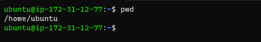

  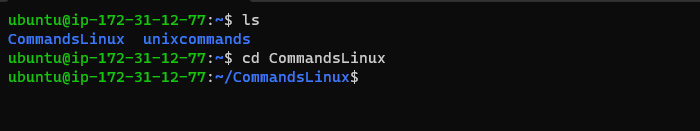

* pwd

  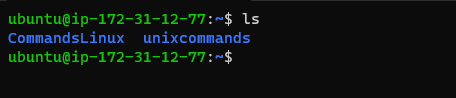

* pwd

  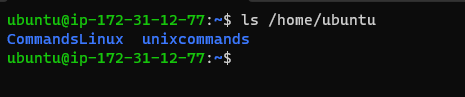

# ls -R

  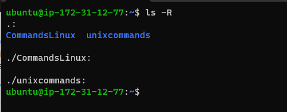

# ls -a

  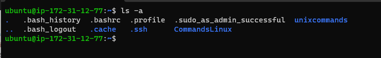

# ls -lh

  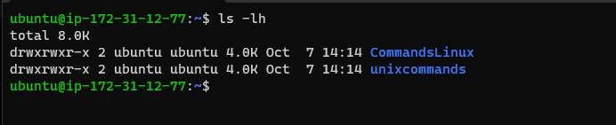

* pwd

  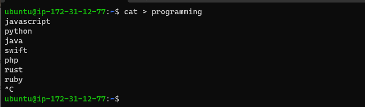

* pwd

  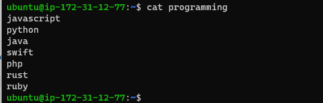

* pwd

  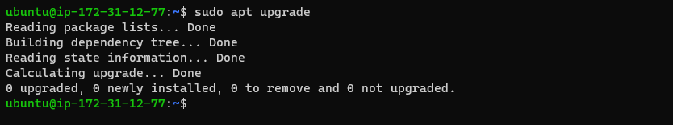

* pwd

  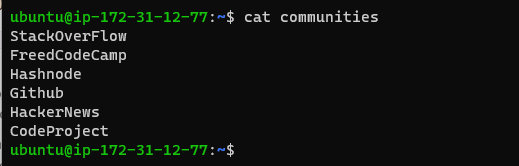

* pwd

  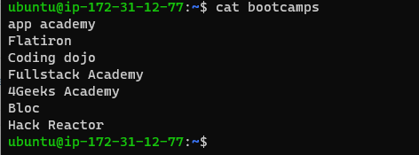

* pwd

  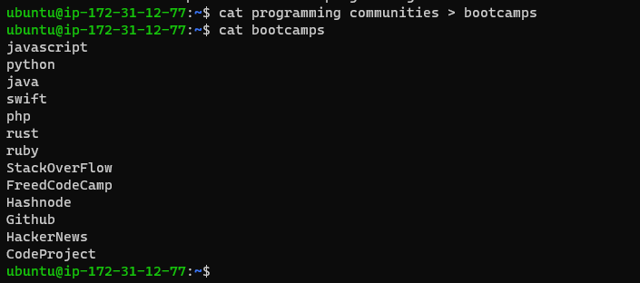

* pwd

  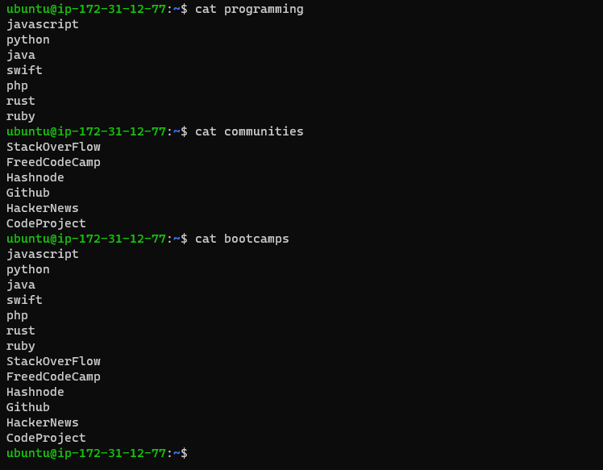

* pwd

  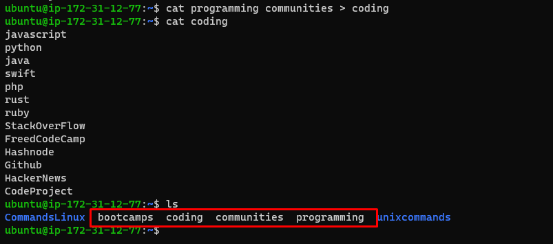

* pwd

  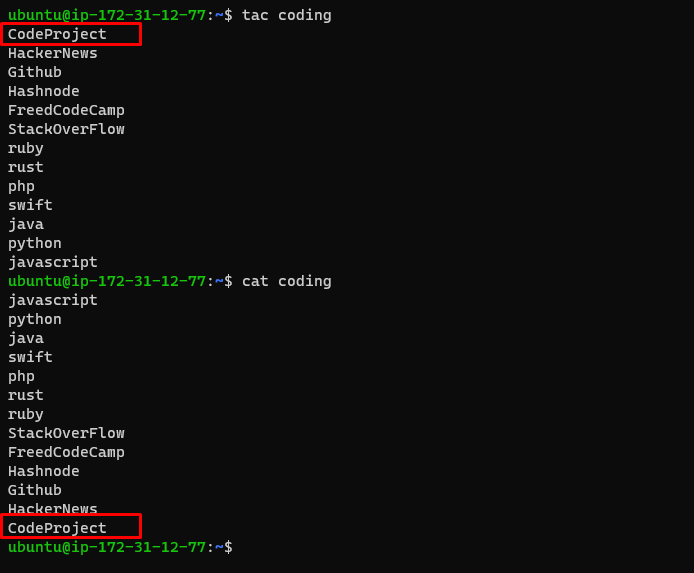

* pwd

  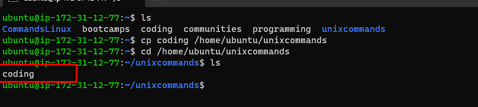

* pwd

  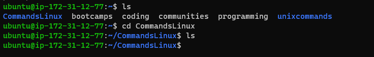

* pwd

  

* pwd

  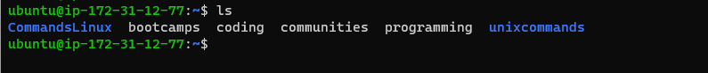

* pwd

  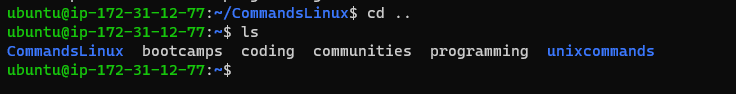

