# Linux_Basics

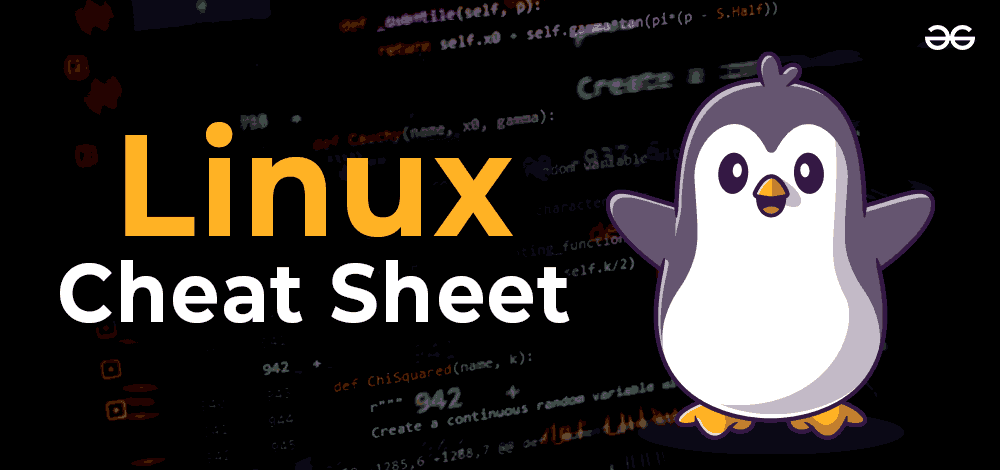

**For a beginner the Linux terminal can be quite scary and intimidating. Here are 40 basic Linux commands for your daily DevOps tasks. But first, lets understand what Linux is.**

> **What is Linux?**

Just like Windows, iOS, and Mac OS, Linux is an operating system. In fact, one of the most popular platforms on the planet, Android, is powered by the Linux operating system. An operating system is software that manages all of the hardware resources associated with your desktop or laptop. To put it simply, the operating system manages the communication between your software and your hardware. Without the operating system (OS), the software wouldn’t function.   

*source : [click here](https://www.linux.com/what-is-linux/)*

## File Manipulation

- **sudo**

  > it runs your command with administrative or root permissions.

  `sudo (command)`

  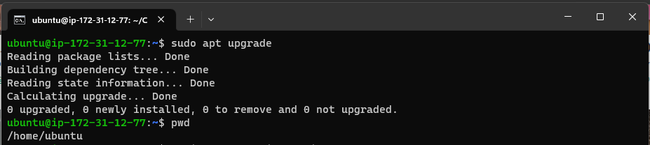

- **pwd**

  > displays the current working directory

  `pwd [option]`

  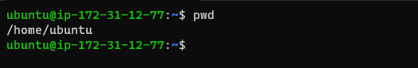

- **cd**

  > changes the curent directory to the specified path

  `cd [Filename]` or `cd /home/ubuntu/Filename`

  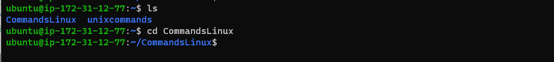
  
- **ls**

  > list files and directories
    - **ls -R** : lists subdirectories recursively
    - **ls a** : shows all files and directories including hidden files
    - **ls -lh** : displays file sizes in a human-readable format
    
  `ls /home/ubuntu`
  `ls -R`
  `ls a`
  `ls -lh`

  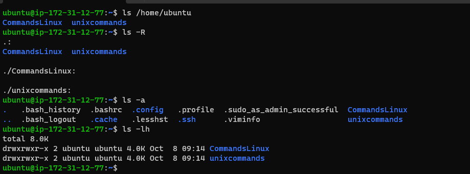

- **cat**

  > this command lists, combines and writes file content to the standard output.
    - `cat > filename` : creates a new file
    - `cat filename.txt filename2.txt > filename3.txt` : merges the first two files and stores the output in **filename3*.txt*
    - `tac filename` : displays content in reverse order

  `cat filename`
  `cat filename filename2 > filename3`
  `tac filename`
  
  
  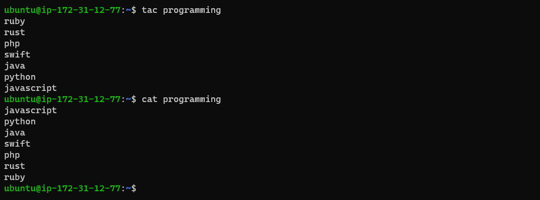

- **cp**

   > this command is to copy files or directories, including their content form your current directory to another.
     - `cp -R` : Duplicating an entire directory, pass the **-R** flag followed by the source and destination directory

  `cp file1 file2 /home/username/Directory`
  `cp filename filename`
  `cp -R /home/username/Directory /home/username/Directory_backup`
  
  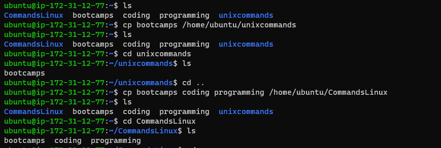
  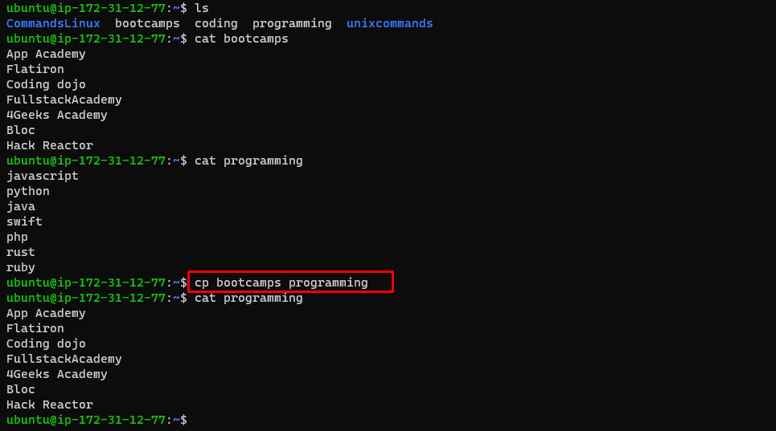
  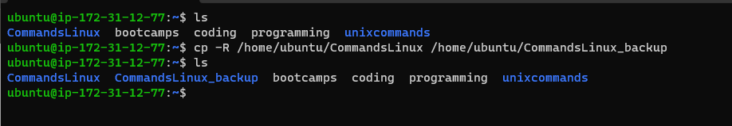

- **mv**

  > use this command to move or rename files and directories. This command can also be use to **renamea file**

  `mv filename /home/username/Directory`
  `mv filename newfile`
  
  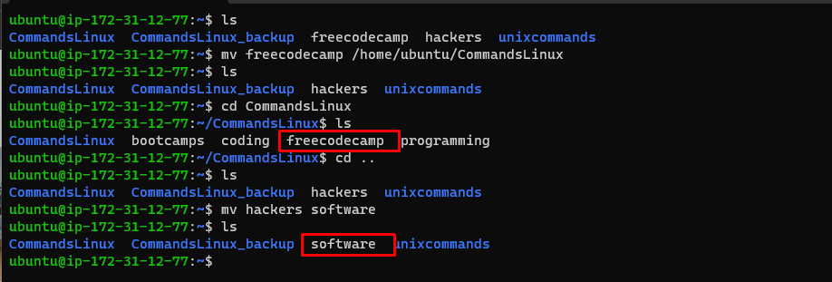

- **mkdir**

  > command to create one or multiple directories and set their permissions. Ensure you are authorized to make a new folder in the parent directory. 
  
  `mkdir [option] directory_name`
  `mkdir Directory/File` 
  
  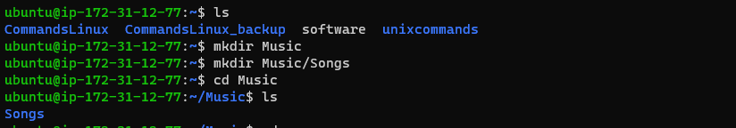

- **rmdir**

  > command to delete an **empty directory**. The user must have sudo privileges in the parent directory.

  `rmdir -p Directory/File`
  
  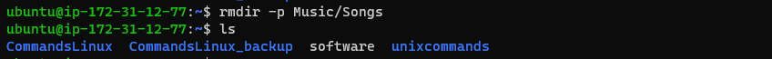

- **rm**

   > use this command to permanently delete files within a directory.

  `rm filename`
  `rm filename1 filename2 filename3`
  
  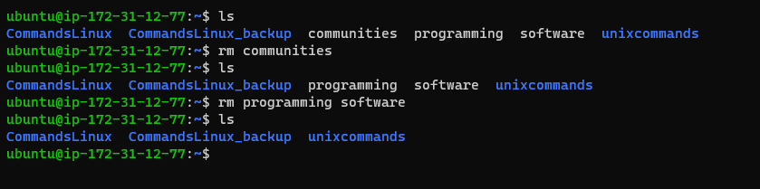

- **touch**

  > the touch command lets you create an empty file in a specified directory path

  `touch filename`
  
  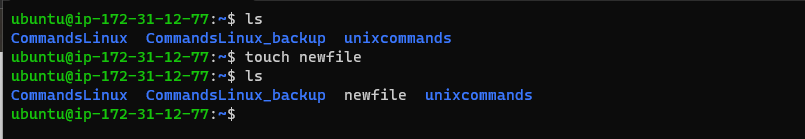

- **locate**

  > lets you find a file in the database system.
  `locate -i filename`
  
  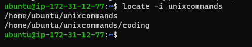

- **find**

  > use this command to search for files within a specific directory

  `find [option] [path] [expression]`
  
  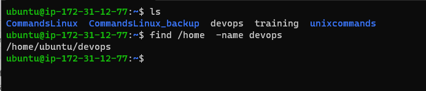

- **grep**

  > lets you find a word by searching the content of a file. The command prints all lines containing the matching strings, this is useful of for filtering.

  `grep [option] filename`
  
  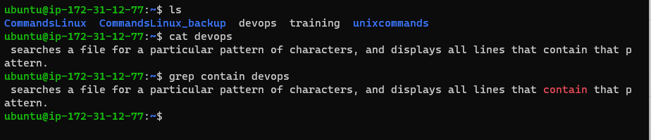

- **df**

   > command to check a Linux systems's disk space usage

  `df [options] [file]`
  `df -h`
  
  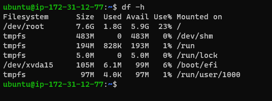

- **du**

    > used to check a file or directory's storage consumption.
  `du /home`
  
  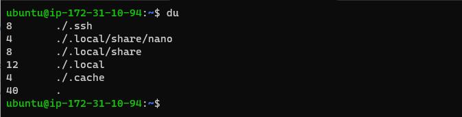

- **head**

   > prints the first ten lines of a text file

  `head [option] [file]`
  
  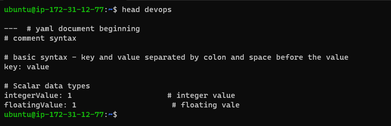

- **tail**

   > displays the last ten lines of a file

  `tail [option] [file]`
   `tail -n [file]`
  
  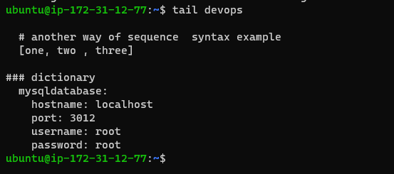 
  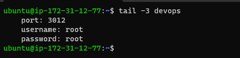

- **diff**

  > compares two files' content and outputs the differences.

  `diff [option] file1 file2`
  
  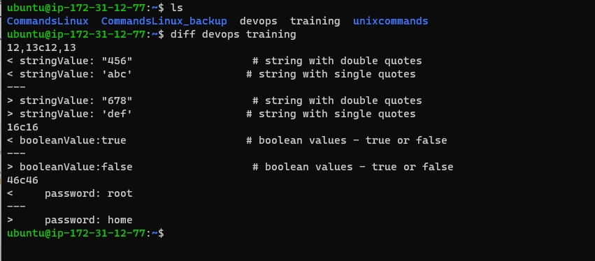

- **tar**

  > The tar command archives multiple items into a **TAR** file
  
  `tar [options] [archive_file] [file or directory]`
  
  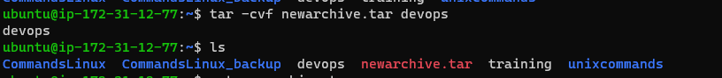

## File Permissions and Ownership

- **chmod**

  > modifies directory or file permissions

  `chmod [option] [permission] [file_name]`
  
  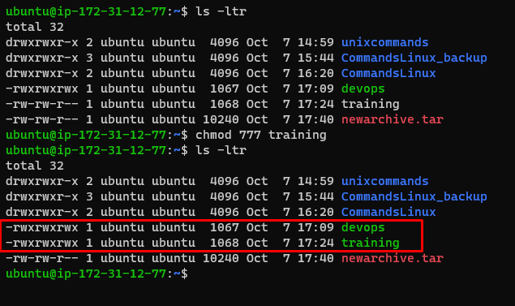

- **chwon**

  > The chown command lets you change a file, directory, or symbolic link’s ownership to the specified username.

  `chwon [option] owner[:group] file(s)`
  
  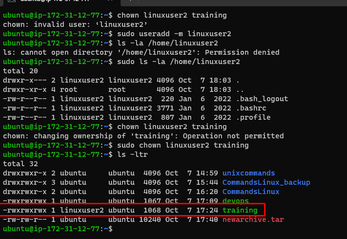

- **jobs**

  > displays a shell's running processes with their statuses. The command will return an empty ouptut if your system doesn't have a running job.

  `jobs [options] jobID`
  
  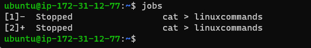

- **kill**

  > command to terminate an unresponsive program using its identification number (PID)
    - `ps ux` : use to check the PID

  `ps ux`
  `kill [signal_option] pid`
  
  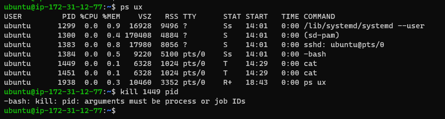

- **ping**

   > lets you check whetehr a network or server is reachable, useful for checking connectivity.

  `ping [option] [hostname_or_IP_address]`
  
  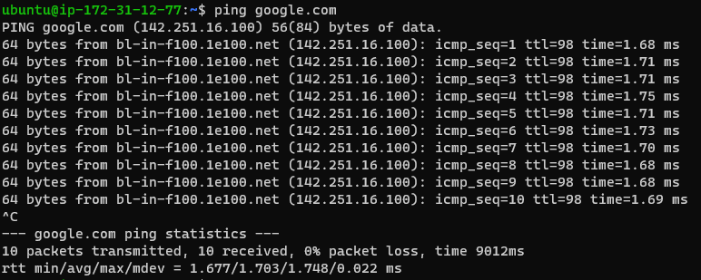

- **wget**

   > command to download files from the internet using HTTP, HTTPS or FTP protocols.

  `wget [option] [url]`
  
  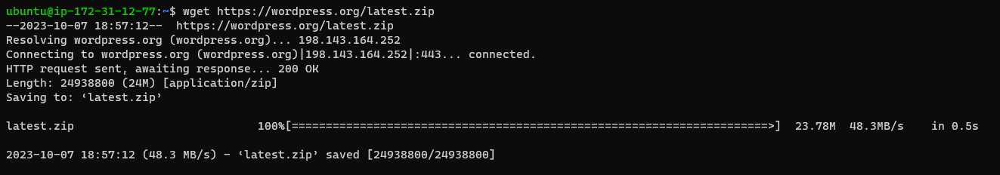

- **uname**

  > prints information about your machine, including hardware, system name.

  `uname [option]`
  
  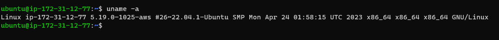

- **top**

  > displays running processes and the system's real-time condition. Helps identify resource-intensive processes.

  `top`
  
  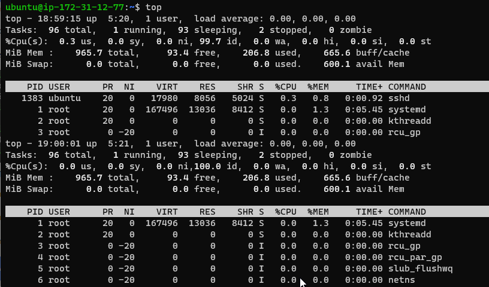

- **history**

  > lists previously executed commands, useful for reusing commands without rewriting them.

  `history [option]`
  
  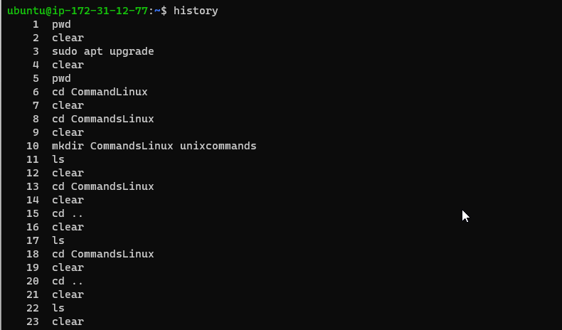
  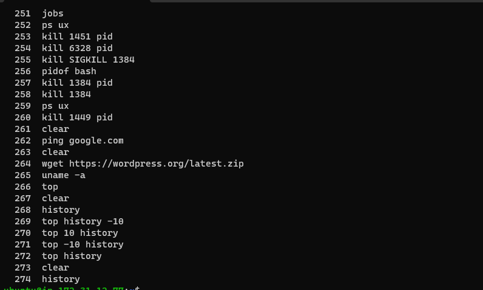

- **man**

  > provides a manual of linux utilities, can be used to look up a commands descriptions and options.

  `man [command_name]`
   `man [option] [section_number] [command_name]`
  
  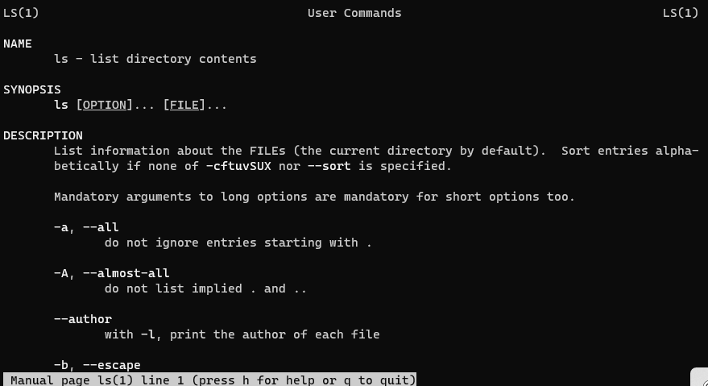

- **echo**

  > displays text as standard output

  `echo [option] [string]`
  
  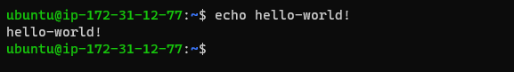

- **zip, unzip**

  > **zip** command lets you compress items into a **ZIP** file.
  > **unzip** this command will extract the compressed file.

   `zip [options] zipfile file1 file2`
   `unzip [option] file_name.zip`
  
  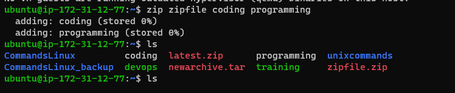
  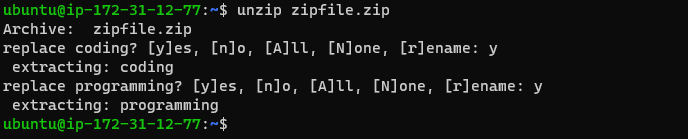

- **hostname**

   > displays the system's hostname

  `hostname [option]`
  
  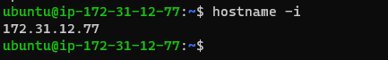

- **useradd, userdel**

  > Use **useradd** to create a new Linux user account and change its password with the **passwd** command

  `useradd [option] username`
  `userdel username`
  
  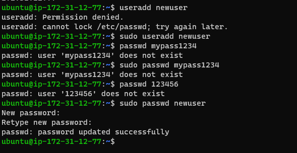
  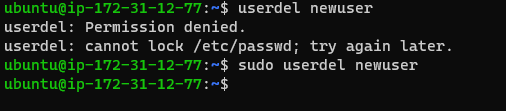

- **apt-get**

  > lets you manage, update, remove and install software including its dependencies. Requires sudo privileges.

  `apt-get [options] (command)`
  
  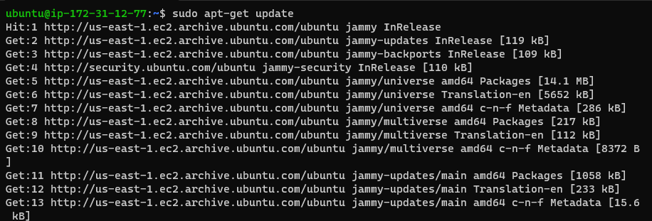

- **nano, vi, jed**

   > editing text editors for Linux. If the target file does not exist, these editors will create one.
 
  `vi [filename]`
  `nano [filename]`
  `jed [filename]`
  
  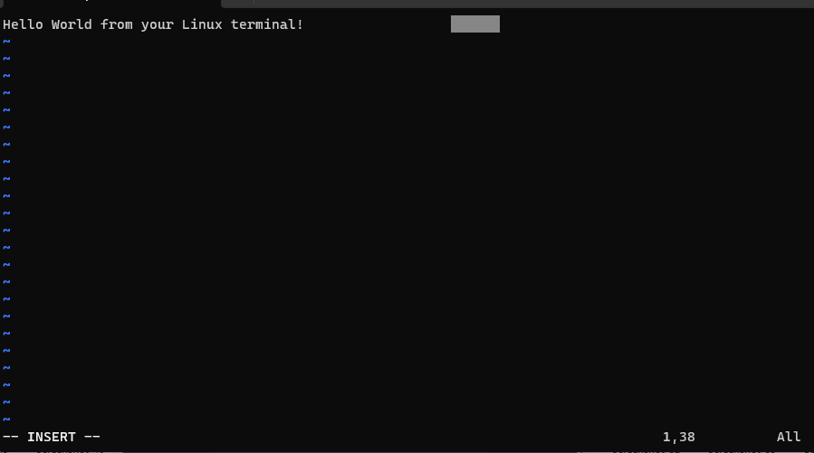

- **alias, unalias**

  > instructs the shell to replace a string with another to  create a shortcut for a program.
    - `unalias [alias_name]` : delets the existing alias

   `alias Name=String`
   `unalias [alias_name]`
  
  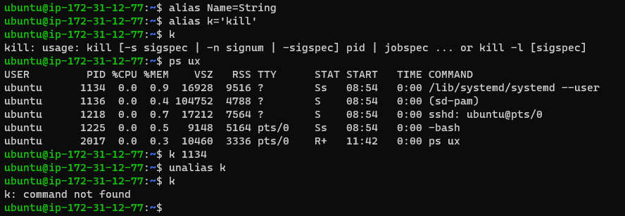

- **su**

  `su [options] [username [argument]]`
  > lets you run a program as a different user.
  
  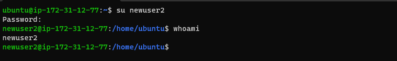

- **htop**

  > monitors system resources and server processes. Has more features than **top**, it offers mouse indicators and visual indicators.

  `htop [options]`
  
  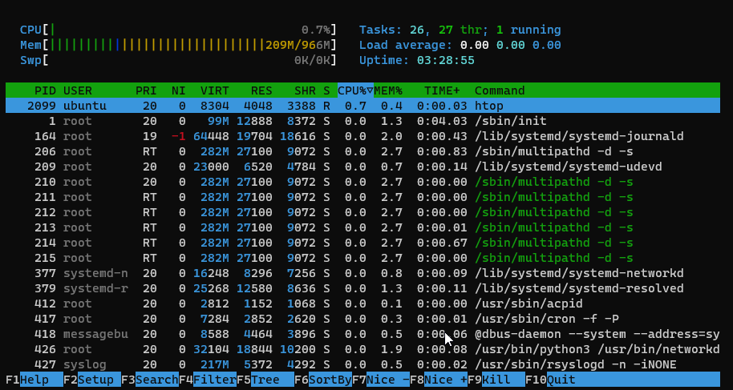

- **ps**

  > creates a snapshot of all running processes in your system.
  
  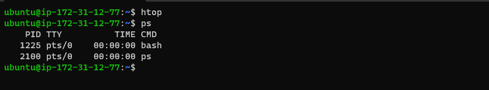

