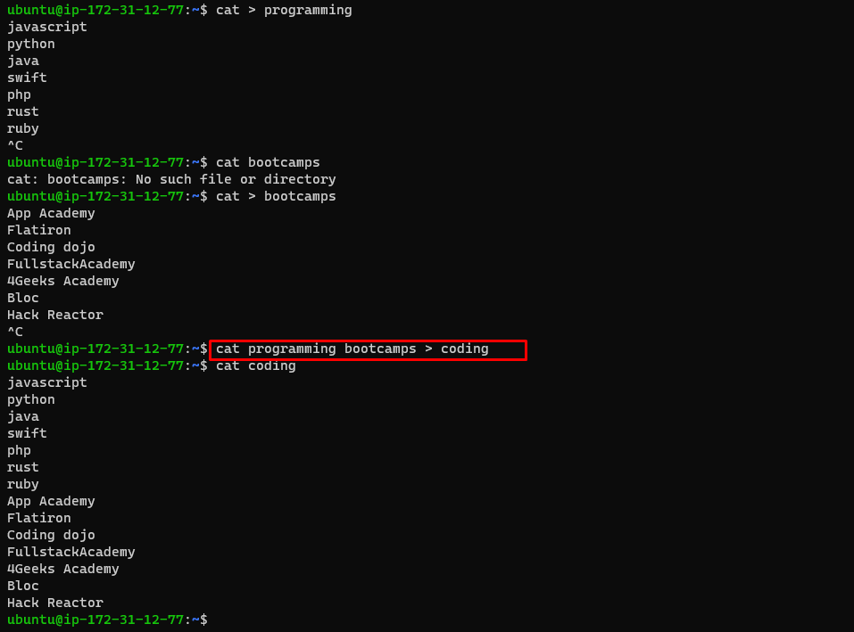

# Linux_Basics

> Linux basic for every DevOps Engineer

## File Manipulation

- **sudo**
  > provides root priviledges to the user

  

- **pwd**
  > provides root priviledges to the user

  

- **cd**
  > provides root priviledges to the user

  
  
- **ls**
  > provides root priviledges to the user

  

- **cat**
  > provides root priviledges to the user
  
  

  `tac`
  

- **cp**
  > provides root priviledges to the user
  
  

  > description of the below
  
  

  > description of the below
  
  

- **mv**
  > provides root priviledges to the user
  
  

- **mkdir**
  > provides root priviledges to the user
  
  

- **rmdir**
  > provides root priviledges to the user
  
  

- **rm**
  > provides root priviledges to the user
  
  

- **touch**
  > provides root priviledges to the user
  
  

- **locate**
  > provides root priviledges to the user
  
  

- **find**
  > provides root priviledges to the user
  
  

- **grep**
  > provides root priviledges to the user
  
  

- **df**
  > provides root priviledges to the user
  
  

- **du**
  > provides root priviledges to the user
  
  

- **head**
  > provides root priviledges to the user
  
  

- **tail**
  > provides root priviledges to the user
  
  

  `tail [option] [file]`
  > provides root priviledges to the user
  
  

- **diff**
  > provides root priviledges to the user
  
  

- **tar**
  > provides root priviledges to the user
  
  

## File Permissions and Ownership

- **chmod**
  > provides root priviledges to the user
  
  

- **chwon**
  > provides root priviledges to the user
  
  

- **jobs**
  > provides root priviledges to the user
  
  

- **kill**
  > provides root priviledges to the user
  
  

- **ping**
  > provides root priviledges to the user
  
  

- **wget**
  > provides root priviledges to the user
  
  

- **uname**
  > provides root priviledges to the user
  
  

- **top**
  > provides root priviledges to the user
  
  

- **history**
  > provides root priviledges to the user
  
  
  

- **man**
  > provides root priviledges to the user
  
  

- **echo**
  > provides root priviledges to the user
  
  

- **zip, unzip**
  > provides root priviledges to the user
  
  
  

- **hostname**
  > provides root priviledges to the user
  
  

- **useradd, userdel**
  > provides root priviledges to the user
  
  
  

- **apt-get**
  > provides root priviledges to the user
  
  

- **nano, vi, jed**
  > provides root priviledges to the user
  
  

- **alias, unalias**
  > provides root priviledges to the user
  
  

- **su**
  > provides root priviledges to the user
  
  

- **htop**
  > provides root priviledges to the user
  
  

- **ps**
  > provides root priviledges to the user
  
  

